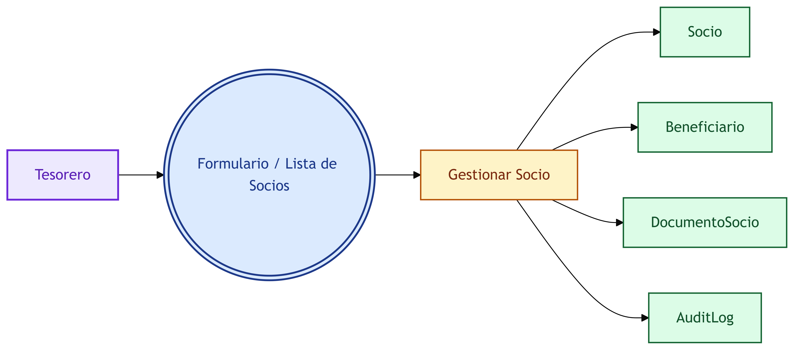
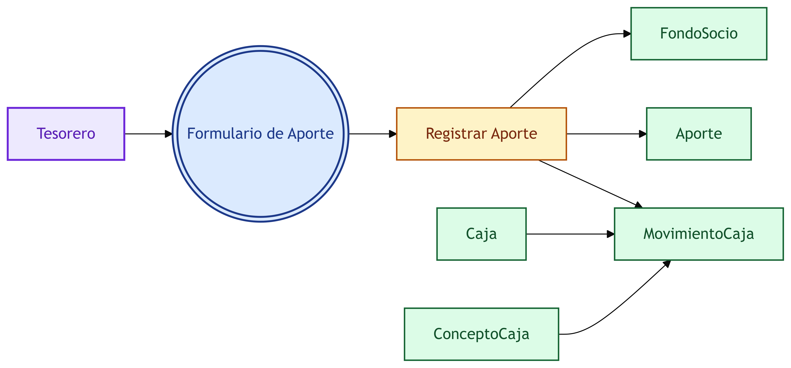
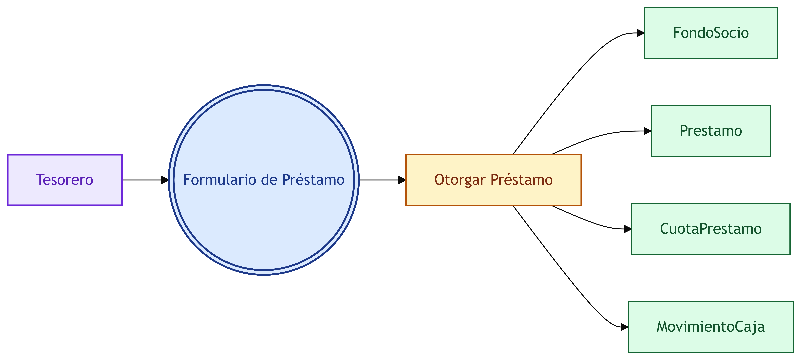
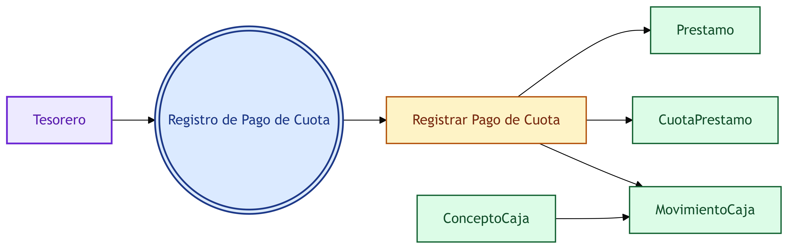
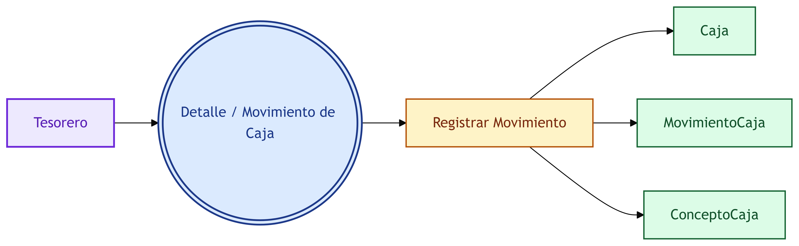
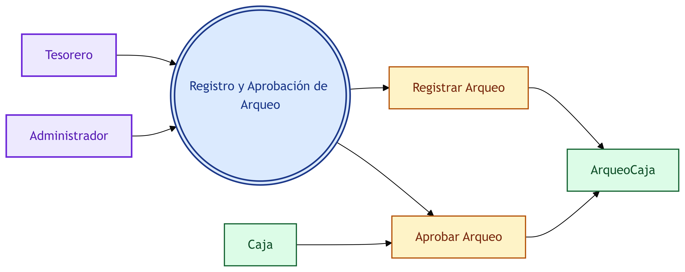
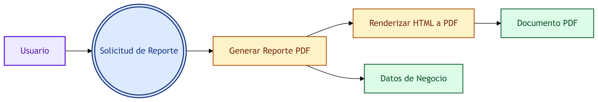

# Artefacto 3 — Análisis de Robustez

El análisis de robustez valida que cada caso de uso sea **realizable con los objetos del dominio**, usando tres estereotipos:

- **Frontera (boundary)** — `Interfaz` de usuario (formularios, vistas, salidas).
- **Control (control)** — Lógica de aplicación que orquesta la operación.
- **Entidad (entity)** — Objetos del dominio (persistentes).


*Cada diagrama corresponde a un caso de uso. Se renderizan en colores: **azul** = frontera, **amarillo** = control, **verde** = entidad.*

## CU-01 — Autenticarse


## CU-02 — Gestionar Socios



## CU-04 — Registrar Aportes



## CU-05 — Otorgar Préstamo



## CU-06 — Registrar Pago de Cuota



## CU-07 — Gestionar Caja



## CU-08 — Realizar Arqueo de Caja



## CU-10 — Generar Reportes PDF



## CU-11 — Consultar Estado de Cuenta


---

### Lectura de un diagrama (ejemplo CU-04)

```
Tesorero → (Interfaz de Aporte) → [Registrar Aporte]
                                         ↓
        ┌────────────┬──────────────┬──────────────────┐
        ↓            ↓              ↓                  ↓
   FondoSocio     Aporte     MovimientoCaja    ConceptoCaja
```

El control `Registrar Aporte` no puede tocar la interfaz ni el usuario: solo orquesta entidades. Esto garantiza que el caso de uso se sostiene con el modelo de dominio y permite detectar **sustantivos faltantes** antes de diseñar las secuencias.
