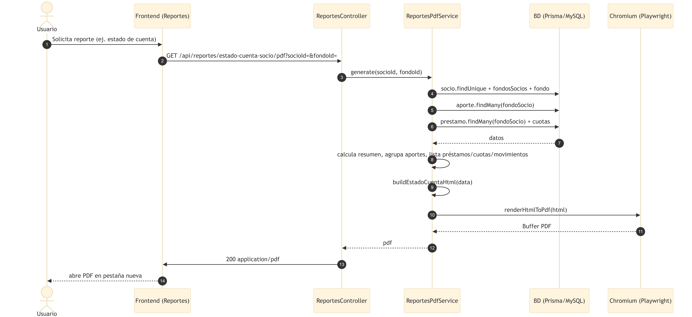

# Artefacto 4 — Diagramas de Secuencia

Los diagramas de secuencia detallan **cómo interactúan los objetos** para realizar cada caso de uso. Muestran los componentes reales del sistema: frontend (React), controladores, servicios y la base de datos vía Prisma.

## CU-01 — Autenticarse


## CU-04 — Registrar Aportes


## CU-05 — Otorgar Préstamo


## CU-06 — Registrar Pago de Cuota


## CU-07 — Gestionar Caja (movimiento)


## CU-08 — Realizar Arqueo de Caja


## CU-10 — Generar Reporte PDF (Playwright)



## CU-11 — Consultar Estado de Cuenta


---

## Patrón de arquitectura reflejado

```
Vista (React) → Controller (validación Zod) → Service (lógica de negocio) → Prisma (MySQL)
```

- Los **controladores** solo validan con Zod y delegan.
- Los **servicios** concentran la lógica y usan transacciones (`$transaction`) para operaciones atómicas (pago de cuota, desembolso, arqueo).
- Las operaciones de negocio registran **movimientos de caja** y **auditoría** de forma consistente.
