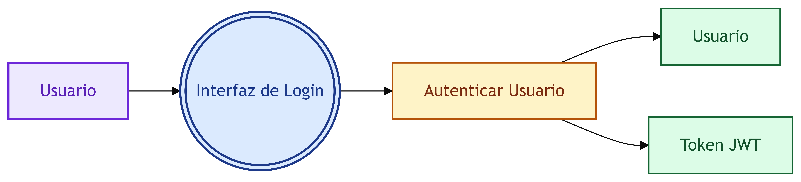

# PLANTILLA DE TESIS — Sistema de Gestión de Banco Comunal

> Ejemplo completo con el módulo de **Autenticación (Login)** como caso demostrativo.
> Sustituye el contenido entre corchetes `[...]` por tus datos reales.

---

## CARÁTULA

- Título: **"Sistema web para la gestión de fondos rotatorios del Banco Comunal [nombre]"**
- Autor: [Tu nombre]
- Asesor: [Nombre del asesor]
- Institución: [Universidad]
- Grado: [Ingeniería de Sistemas / Computación]
- Fecha: [Mes, Año]

---

## RESUMEN

El presente proyecto desarrolla un sistema web para la gestión integral de un banco comunal, abarcando el registro de socios, fondos rotatorios, aportes, créditos y la administración de caja. El sistema fue construido bajo una arquitectura por capas (interfaz → controlador → servicio → base de datos) aplicando la metodología ICONIX para el análisis y diseño. El desarrollo se realizó con [React, Node.js, Express, Prisma y MySQL], y el backend expone una API REST protegida mediante autenticación con JWT y contraseñas encriptadas con bcrypt.

**Palabras clave:** fondo rotatorio, banco comunal, ICONIX, API REST, arquitectura por capas.

---

## CAPÍTULO I — PLANTEAMIENTO DEL PROBLEMA

### 1.1 Realidad problemática
[3–5 párrafos: describe cómo el banco comunal lleva sus cuentas hoy (cuadernos, Excel), qué errores/problemas genera (pérdida de registros, morosidad no controlada, caja desbalanceada), y por qué es necesario un sistema.]

### 1.2 Formulación del problema
**Problema general:**
¿De qué manera la implementación de un sistema web mejora la gestión de aportes, créditos y caja en un banco comunal?

**Problemas específicos:**
- ¿Cómo registrar de forma confiable los aportes de los socios evitando duplicados?
- ¿Cómo controlar los cronogramas de pago y detectar cuotas vencidas?
- ¿Cómo garantizar que solo personal autorizado acceda a la información?

### 1.3 Objetivos
**General:** Desarrollar un sistema web para la gestión del banco comunal que automatice el registro de socios, fondos, aportes, créditos y caja.

**Específicos:**
- Implementar el registro y control de socios y sus aportes.
- Implementar la gestión de créditos con generación automática de cronogramas.
- Implementar el control de caja con arqueos y proyecciones de flujo.
- Implementar autenticación y control de acceso por roles.

### 1.4 Justificación
[Tecnológica, económica y social: por qué aporta valor este sistema.]

### 1.5 Alcance y limitaciones
- **Alcance:** módulos de socios, fondos, aportes, créditos, caja, reportes PDF y usuarios.
- **Limitaciones:** no incluye banca móvil, no integra pasarela de pagos, los reportes dependen de Playwright.

---

## CAPÍTULO II — MARCO TEÓRICO

### 2.1 Marco conceptual
| Término | Definición |
|---------|-----------|
| Fondo rotatorio | Fondo comunitario de ahorro y crédito al que pertenecen los socios |
| Aporte | Cuota periódica del socio (obligatoria, voluntaria, extraordinaria, multa) |
| Préstamo | Crédito otorgado con cronograma de cuotas (interés + amortización) |
| Arqueo de caja | Verificación del saldo físico vs. saldo del sistema |
| JWT | Token firmado que autentica y autoriza peticiones |

### 2.2 Arquitectura por capas
La aplicación se organiza en cuatro capas. Cada capa tiene una responsabilidad única:

```
┌─────────────────────────────┐
│  CAPA DE PRESENTACIÓN       │  React + Vite (frontend)
│  Captura y muestra datos    │
├─────────────────────────────┤
│  CAPA DE CONTROLADOR        │  Express (backend)
│  Valida formato (Zod)       │
│  Traduce HTTP ↔ servicio    │
├─────────────────────────────┤
│  CAPA DE SERVICIO           │  Lógica de negocio
│  Reglas, transacciones      │
├─────────────────────────────┤
│  CAPA DE DATOS              │  MySQL vía Prisma ORM
│  Persistencia               │
└─────────────────────────────┘
```

**Ventajas:** separación de responsabilidades, testabilidad, reutilización, y que cambiar la BD o el frontend no rompe la lógica de negocio.

### 2.3 Metodología ICONIX
ICONIX es una metodología de análisis y diseño dirigida por casos de uso, que combina los puntos fuertes de RUP y Agile. Se compone de cuatro modelos iterativos:

1. Modelo de dominio
2. Modelo de casos de uso
3. Análisis de robustez
4. Diagramas de secuencia y diagrama de clases de diseño

*[Incluir aquí la referencia bibliográfica del libro de Rosenberg y Scott, "Applying Use Case Driven Object Modeling with UML".]*

### 2.4 Herramientas de desarrollo
| Herramienta | Uso |
|-------------|-----|
| React + Vite | Interfaz de usuario |
| Node.js + Express | API REST |
| Prisma ORM | Acceso a datos |
| MySQL | Base de datos |
| Zod | Validación de entrada |
| JWT + bcrypt | Autenticación y seguridad |
| Playwright | Generación de reportes PDF |
| Mermaid | Diagramas UML (ICONIX) |

---

## CAPÍTULO III — DESARROLLO DEL SISTEMA (aplicación de ICONIX)

*En este capítulo se presentan los 5 artefactos ICONIX. El ejemplo completo del **login** se desarrolla en cada uno.*

### 3.1 Modelo de dominio

**Descripción:** identifica las entidades del negocio y sus relaciones, sin detalle técnico.


**Vínculo con el sistema real:** las entidades corresponden a las tablas del esquema Prisma ([`backend/prisma/schema.prisma`](../backend/prisma/schema.prisma)).

### 3.2 Modelo de casos de uso

**Diagrama de casos de uso:**


**Catálogo de casos de uso:**

| Código | Caso de uso | Actor |
|--------|-------------|-------|
| CU-01 | Iniciar sesión | Tesorero, Administrador |
| CU-02 | Gestionar socios | Tesorero |
| CU-03 | Gestionar fondos rotatorios | Administrador |
| CU-04 | Registrar aportes | Tesorero |
| CU-05 | Otorgar préstamo | Tesorero |
| CU-06 | Registrar pago de cuota | Tesorero |
| CU-07 | Gestionar caja | Tesorero |
| CU-08 | Realizar arqueo de caja | Administrador |
| CU-09 | Gestionar usuarios | Administrador |
| CU-10 | Generar reportes PDF | Tesorero, Administrador |
| CU-11 | Consultar estado de cuenta | Tesorero, Administrador |

**Ficha del caso de uso CU-01 — Iniciar sesión:**

| Atributo | Descripción |
|----------|-------------|
| Actor | Tesorero, Administrador |
| Precondición | El usuario existe y está activo |
| Flujo principal | 1. El actor ingresa usuario y contraseña<br>2. El sistema valida las credenciales<br>3. El sistema muestra el menú principal según el rol |
| Flujos alternativos | **FA1:** credenciales incorrectas → el sistema muestra "Usuario o contraseña incorrectos"<br>**FA2:** cuenta desactivada → el sistema muestra "La cuenta está desactivada" |
| Poscondición | Sesión iniciada; el frontend recibe un token JWT |

### 3.3 Análisis de robustez

**Descripción:** valida que los casos de uso sean realizables, clasificando cada elemento como **frontera (interfaz)**, **control** u **entidad**. No introduce objetos inventados.


**Ejemplo — Robustez de CU-01 (Iniciar sesión):**



**Lectura:** el actor interactúa con el formulario de login (frontera), el control *ValidarCredenciales* consulta a la entidad *Usuario*, y en caso de éxito el control *GenerarToken* devuelve el JWT. El diagrama confirma que el caso de uso es realizable y muestra los objetos que participarán.

### 3.4 Diagramas de secuencia

**Descripción:** detallan la interacción entre los objetos a lo largo del tiempo. Aquí se materializa la arquitectura por capas.

**Ejemplo — Secuencia CU-01 (Iniciar sesión):**


**Explicación textual del flujo:**
1. La **interfaz** envía `POST /api/configuracion/login` con usuario y contraseña.
2. El **controlador** valida el formato con Zod (`loginSchema`) y delega en el servicio.
3. El **servicio** busca el usuario en la BD; si no existe o la cuenta está desactivada, lanza error.
4. El **servicio** compara la contraseña con `bcrypt.compare` (la contraseña está hasheada).
5. Si es correcta, actualiza `ultimoAcceso` y firma un **token JWT** con `{ userId, username, rol }`.
6. El token regresa por la cadena hasta la interfaz; el frontend lo guarda para las peticiones siguientes.

### 3.5 Diagrama de clases de diseño

**Descripción:** resultado final del diseño: el modelo de dominio actualizado con atributos y operaciones reales (métodos de los servicios).


**Vínculo con la implementación:**

| Clase | Tabla Prisma | Servicio |
|-------|--------------|----------|
| Usuario | `usuario` | `configuracionService.ts` |
| Socio | `socio` | `socioService.ts` |
| Aporte | `aporte` | `aporteService.ts` |
| Prestamo | `prestamo` | `creditoService.ts` |
| Caja | `caja` | `cajaService.ts` |

---

## CAPÍTULO IV — IMPLEMENTACIÓN DE LA SOLUCIÓN

### 4.1 Arquitectura general del sistema

```
Browser (React)
   │  HTTPS + JWT
   â–¼
Express API ──► [Router → Controlador → Servicio → Prisma → MySQL]
   │
   └── Playwright (generación de PDF)
```

### 4.2 Estructura del proyecto

```
backend/
  src/
    modules/
      socios/       (controlador, servicio, validación, rutas)
      fondos/
      aportes/
      creditos/
      caja/
      reportes/
      configuracion/
    middeware/auth.ts   (verificación de JWT)
    ...
  prisma/schema.prisma
frontend/
  src/
    modules/          (páginas y componentes por módulo)
```

### 4.3 Ejemplo de implementación — Autenticación (login)

**Controlador** — valida el formato y delega:

```ts
async login(req: Request, res: Response, next: NextFunction) {
  const { username, password } = loginSchema.parse(req.body)
  const result = await configuracionService.login(username, password)
  res.json(result)
}
```

**Servicio** — aplica la lógica y reglas de negocio:

```ts
async login(username: string, password: string) {
  const usuario = await prisma.usuario.findUnique({ where: { username } })
  if (!usuario) throw new HttpError(400, 'Usuario o contraseña incorrectos')
  if (usuario.estado !== 'ACTIVO') throw new HttpError(400, 'La cuenta está desactivada')

  const validPassword = await bcrypt.compare(password, usuario.password)
  if (!validPassword) throw new HttpError(400, 'Usuario o contraseña incorrectos')

  await prisma.usuario.update({ where: { id: usuario.id }, data: { ultimoAcceso: new Date() } })

  const token = jwt.sign(
    { userId: usuario.id, username: usuario.username, rol: usuario.rol },
    env.JWT_SECRET,
    { expiresIn: env.JWT_EXPIRES_IN as jwt.SignOptions['expiresIn'] },
  )

  return { token, user: { id: usuario.id, nombres: usuario.nombres, username: usuario.username, rol: usuario.rol } }
}
```

**Middleware de protección** — verifica el token en cada petición:

```ts
// middeware/auth.ts (fragmento conceptual)
const payload = jwt.verify(token, env.JWT_SECRET)   // valida firma y expiración
req.userId = payload.userId                          // inyecta el usuario autenticado
```

**Explicación de seguridad (lo que el jurado valora):**
- Las contraseñas **nunca se guardan en texto plano**: se almacenan con el hash de **bcrypt** (salt de 12 rondas), y la verificación usa `bcrypt.compare`.
- La sesión se maneja con **JWT** firmado con `JWT_SECRET`; cada petición posterior lo envía en el header `Authorization: Bearer <token>`.
- El middleware `auth.ts` valida firma y expiración en cada petición y **no permite el acceso si el token no es válido**.
- Los roles (`Tesorero`, `Administrador`) viajan dentro del token y controlan el acceso a los módulos.

---

## CAPÍTULO V — PRUEBAS

### 5.1 Plan de pruebas
| # | Caso de prueba | Entrada | Resultado esperado |
|---|----------------|---------|--------------------|
| P01 | Login exitoso | Usuario y contraseña correctos | Token JWT y acceso al sistema |
| P02 | Contraseña incorrecta | Usuario correcto, contraseña errada | Error "Usuario o contraseña incorrectos" |
| P03 | Usuario inexistente | Usuario no registrado | Error "Usuario o contraseña incorrectos" |
| P04 | Cuenta desactivada | Usuario con estado INACTIVO | Error "La cuenta está desactivada" |
| P05 | Acceso sin token | Petición a una ruta protegida | HTTP 401 no autorizado |
| P06 | Token expirado | Token vencido | HTTP 401 no autorizado |
| P07 | Aporte duplicado | Mismo periodo y tipo | Rechazo con mensaje de validación |
| P08 | Arqueo con diferencia | Saldo físico ≠ saldo sistema | Registro de diferencia y estado pendiente |

### 5.2 Resultados
[Tabla con: prueba ejecutada, resultado obtenido (aprobado/fallido), observaciones.]

### 5.3 Evidencias
[Capturas de pantalla del sistema: login, mensajes de error, módulos principales.]

---

## CAPÍTULO VI — CONCLUSIONES Y RECOMENDACIONES

### 6.1 Conclusiones
- La aplicación de la metodología ICONIX permitió [verificar la factibilidad de los casos de uso antes de implementar / documentar el diseño de forma trazable con el código].
- La arquitectura por capas garantizó [mantenibilidad, seguridad, separación de responsabilidades].
- El uso de JWT + bcrypt aseguró [que solo personal autorizado acceda al sistema].

### 6.2 Recomendaciones
- Implementar [módulo de remesas / banca móvil] como trabajo futuro.
- Realizar copias de seguridad periódicas de la base de datos.
- Añadir pruebas automatizadas (unitarias e integrales) al flujo de aportes y créditos.

---

## ANEXOS

- **Anexo A:** diagramas ICONIX completos (`docs/iconix/`).
- **Anexo B:** script de la base de datos ([`BD/`](../BD)).
- **Anexo C:** manual de usuario.
- **Anexo D:** manual de instalación (requisitos, variables de entorno, pasos de despliegue).

---

## REFERENCIAS BIBLIOGRÁFICAS

1. Rosenberg, D. y Scott, K. *Applying Use Case Driven Object Modeling with UML*. Addison-Wesley, 2001.
2. [Libro de análisis y diseño orientado a objetos que uses en tu universidad.]
3. [Documentación oficial de React, Node.js, Prisma o MySQL.]

